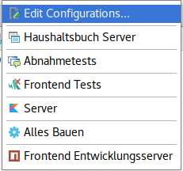

Dominium
========

Eine Buchhaltung für private Haushalte.

*... und eine Experimentierwiese für mich zum Ausprobieren verschiedener
Techniken.*

[](https://travis-ci.org/haschi/dominium)

Anforderungen
-------------
TODO

Ausführungskonfigurationen
--------
Nach dem Auschecken des Projekts sollten folgende Run/Debug Konfigurationen
in IntelliJ vorhanden sein: 



 * **Alles Bauen** Baut das ganze Projekt und lässt die Tests durchlaufen (mvn clean verify)
 Diese Ausführungskonfiguration beinhaltet auch den Bau und den Test des
 Frontends. Diese Konfiguration existiert vor allem, um den CI Build auf dem
 Entwicklungsrechner durchzuführen. Backend Entwickler sollten die Ausführungskonfiguration
 **Server** bevorzugen bzw. das Projekt mit *Build Project* aus dem
 *Build* Menü von IntelliJ IDEA bauen. 
 * **Server** Startet den Backend Server auf http://localhost:8080. Das Frontend wird durch
 den Backend Server mit ausgeliefert. Es ist jeweils die letzte durch **Alles Bauen**
 (mvn clean verify) gebaute Frontend enthalten.
 * **Frontend Entwicklungsserver** Startet den Frontend Entwicklungsserver auf 
 http://localhost:4200 und leitet die Anfragen zum Backend über einen Proxy an Port 8080 weiter.
 Ein Fake Backend ist damit überflüssig. (entspricht npm run start)
 * **Frontend Tests** Führt die Karma Unittests des Frontends aus. (entspricht 
 npm run test)
 * **Abnahmetests** führt die Cucumber Tests aus.

Integrationsumgebung
----

Die Tests benötigen Docker. Für die Installation auf Debian folge den Anweisungen
auf [Get Docker CE for Debian](https://docs.docker.com/engine/installation/linux/debian/#debian-jessie-80-64-bit)


Haushaltsbuch
=============

Eine Buchhaltung für den Privathaushalt.

1. [Anleitung für das Schreiben von Funktionalitäten und Szenarien]()
2. [Funktionalitäten]()
2. [Buchführungsregeln]()
3. [Coding-Style - nicht aktuell]()
4. [Build-Prozess]()

Architekturziele
================

Qualitätsziele (Top 3)
----------------------
 * Langfristige Wartbarkeit (> 20 Jahre)
    * Anpassung an den technologischen Wandel
    * einfache/schnelle technische und fachliche Änderbarkeit
    * einfache/schnelle technische und fachliche Erweiterbarkeit
 * Bedienbarkeit
    * Hohe Benutzerfreundlichkeit
    * Unterstützung der Arbeitsprozesse 
    * Niedrige Lernkurve
    * Kurze Antwortzeiten
 * Sicherheit?
 
Randbedingungen
---------------

  * Fertigstellung einer pilotierbaren Version zum 1.5.201X
  * Material Design im Frontend
  * ...
  
  
Architektur
===========

Ziel ist die von [Jeffrey Palermo](http://jeffreypalermo.com/about/) in seinem Artikel 
[The Onion Architecture](http://jeffreypalermo.com/blog/the-onion-architecture-part-1/)
beschriebene Architektur zu verwendet.

Gründe:
* DDD und Onion Architecture verfolgen beide das Ziel den fachlichen Kern frei von technischen 
Belangen zu halten.
* Die Onion Architecture verfolgt ein einfaches und konsequentes Konzept der Abhängigkeitsumkehrung 
(Dependency Inversion) zur Entkopplung der einzelnen Schalen um die den Business Value enthaltene
fachliche Domäne von technischen Einflüssen zu entkoppeln. Damit wird auch bei technologischem
Wandel und 
* Mit der traditionellen Layered-Architecture kann eine technische Durchdringung der Domäne nicht 
verhindert werden.


* Die Anwendung ist um ein unabhängiges Objektmodell herum entwickelt
* Innere Ebenen definieren Schnittstellen. Äußere Ebenen implementieren Schnittstellen
* Die Kopplung erfolgt von außen nach innen
* Der Code des Anwendungskerns kann unabhängig von der Infrastruktur übersetzt und ausgeführt werden.

Die Literatur enthält bislang keine Vorlagen, wie ein CQRS System respektive Axon Projekt auf die 
Onion Architektur konkret abgebildet werden kann. 


Zielstruktur:
-------------
Mapping der Ringstruktur auf ein hierachische Modul und Package Struktur:

* **User Interface** (<u>Modul</u> projekt-ui)
    * frontend (NPM Projekt mit Angular) ?
    * rest (<u>Package</u> *rest*)
* **Infrastructure** (<u>Maven Modul</u> *projektname*-infrastructure)       
    * services (<u>Package</u> *services*)
        * Infrastrukurfabrik (Implementierung)
        * Für jeden Service ein Package
* **Test** (Maven Teststruktur)        
* **Application Core** (<u>Maven Modul</u> *projektname*-core)
    * **Application Services** (<u>Package</u> *application*)
        * Spezialisierte Command Gateways
        * Query Gateway ?
        * Infrastrukturfabrik (Schnittstelle)
        * Lesemodelle für externe Systeme und Frontend
        * pro Service ein Package
    * **Domain Services** (<u>Package</u> *domain*)
        * Ein Service (<u>Package</u> *servicename*)
        * Sagas
        * Command Handler
        * Event Handler
        * Projektionen (Lesemodelle für die Domäne)
    * **Domain Model** (<u>Package</u> *model*)
        * Anweisungen (<u>Package</u> *commands*)
        * Ereignisse (<u>Packages</u> *events*)
        * Abfrage (<u>Package</u> *queries*)
        * Wertobjekte (<u>Package</u> *values*)
        * _Aggregate_
        * _Entitäten_
        * _Schnittstellen_ zu Diensten äußerer Schalen

Infrastructure
--------------
Infrastruktur Dienste konzentrieren auf die technischen Aspekte der Anwendung. Dazu gehören 
Dateizugriffe, Datenbankzugriffe, E-Mail versandt und ähnliches.

Die Schnittstellen werden in der Domänenschicht deklariert und sind wichtige Aspekte der Domäne. 
Die Besonderheiten der technischen Umsetzung, wie zum Beispiel die Kommunikation mit dauerhaften 
Speichermedien werden jedoch in der Infrastrukturschicht behandelt.

Die Infrastuktur stellt einen Webserver bereit (z.B. durch Vert.x, Spring Boot oder Wildfly Swarm)
um ein Frontend auszuliefern und Webservices bereitzustellen.

### Frontend

Das Frontend ist eine Angular Anwendung als NPM bzw Angular CLI Projekt innerhalb der Infrastruktur
Schale. Der Buildprozess erzeugt Resourcen, die dem Infrastruktur Deployment hinzugefügt werden
und dem in die Infrastruktur integrierten Webserver bereitgestellt werden.

Application Services
--------------------

Ein Anwendungsdienst hat eine wichtige und unterscheidende Rolle - er stellt eine Hosting-Umgebung 
für die Ausführung der Domänenlogik bereit. Somit ist es ein günstiger Punkt, um verschiedene 
Gateways wie ein Repository oder Wrapper für externe Dienste zu injizieren. Ein häufiges Problem 
beim Anwenden von DDD ist, wenn eine Entität Zugriff auf Daten in einem Repository oder einem 
anderen Gateway benötigt, um eine Geschäftsoperation auszuführen. Eine Lösung besteht darin, 
Repository-Abhängigkeiten direkt in die Entity zu injizieren, was jedoch oft verpönt ist. Ein 
Grund dafür ist, dass es erfordert, dass die Plain-Old- (C #, Java, usw.) Objekte, die Entitäten 
implementieren, Teil eines Anwendungsabhängigkeitsgraphen sind. Ein weiterer Grund ist, dass das 
Nachdenken über das Verhalten von Entitäten erschwert wird, da das Prinzip der einheitlichen 
Verantwortung verletzt wird. Eine bessere Lösung besteht darin, dass ein Anwendungsdienst die von 
einer Entität benötigten Informationen abruft, sodass die Ausführungsumgebung effektiv eingerichtet 
und der Entität bereitgestellt wird.

Oder auf deutsch:

Als Hosting-Umgebung kann die Konfiguration durch Axon betrachtet werden. Die Axon Konfiguration
stellt eben die Gateways zur Verfügung und bindet die von der Infrastruktur angebotenen konkreten
technischen Dienste ein: Event Store, Command-, Event- und Query-Bus ...

Anit Corruption Layer, die als Vermittler zwischen dem internen Model und externen Systemem stehen,
sind Application Services. Sie sind weder Bestandteil der Domäne noch reine Infrastruktur Services.
Die infrastrukturellen Aspekte eines ACL müssen aber durch Infrastruktur Services realisiert werden.  

Die Infrastruktur muss also folgende Schnittstellen implementieren:

* Infrastrukturfabrik
    * Event Store und Event Bus
    * Command Bus    
    * Logger
    * ...
 
Die Aufgabe besteht in der Registrierung der Command- und Eventhandler, um die korrekte Ausführung
der einzelnen Systembestandteile zu ermöglichen. 

Domain Services
---------------

Diensten, die Domänenkonzepte einbetten und bearbeiten und Teil der allgegenwärtigen Sprache sind.

Domain Model
------------
  * Aggregate, 
  * Entitäten, 
  * Wertobjekte.
  * Schnittstellen zu Domain- und Application Serives 
    
  * Commands, 
  * Events
  * Queries

Vertikale Schnitte
==================

## Variante Shared Kernel

* **Application Core**    
    * **Application Services**
    * **Shared Kernel** (Package shared)
        * **Domain Services**
        * **Domain Model**    
    * **Modul A**
        * **Domain Services**
        * **Domain Model**
    * **Modul B**
        * **Domain Service**
        * **Domain Model**

Lesemodelle
===========

Wohin gehören Abfragen und Lesemodelle eines CQRS-Systems? Muss die Leseseite eigenständig
skalierbar sein und gehört ein ein selbstständig ausführbares und skalierbares verteilbares
Auslieferungsgegenstand?

Projektionen, die von Domänendiensten benötigt werden, um eine fachliche Aufgabe zu erfüllen
sind offensichtlich selbst Domönendienste und gehören daher in die Domain Service Schale. 
Allerdings können Infrastruktur Dienste beteiligt werden, sofern Persistenz oder externe
Systeme für die Realisierung der Projektion erforderlich sind. Gemäß dem Architekturgrundsatz 
müssen Infrastrukturdienste durch Abhängigkeitsumkehrung in die Domänen Service Schale
gebracht werden.

Andere Projektionen, die Informationen an andere Systeme oder ausschlie0lich dem Frontend 
bereitstellen gehören nicht in die Domain Service Schale. Da Sie aber auch nicht zur Infrastruktur
gehören, ist die Application Service Schale der richtige Ort. Sie stellen eine bedeutsame 
Schnittstelle zur Anwendung bereit, tragen jedoch nicht zum Business bei.

Frontend Muster 
===============

Für die Formulareingabe werden ausschließlich Reactive Forms verwendet.
Siehe Inventur Komponente.
Die Form besitzt ein onSubmit Ereignis, welche von der Komponente behandelt wird.
Buttons müssen entweder type=submit (default) oder type=button sein.
Buttons mit dem Attribut type=button lösen das Submit Ereignis nicht aus.

Command Gateway
---------------

TODO

Query Gateway
-------------

TODO

Fortschrittsanzeige
-------------------
Laufende Anfragen an den Commandbus oder den Querybus werden mit den
Komponenten CommandProgressComponent (<app-command-progress>) und QueryProgressComponent
(<app-query-progress) angezeigt. Beide zeigen abhängig vom Zustand des
Redux Speichers einen Fortschrittsbalken mit dem Modus "indeterminate".

Code Richtlinien
================

In Bezeichnern dürfen keine Umlaute und Sonderzeichen verwendet werden.

Namenskonventionen
------------------

[Benennung von Actions](https://decembersoft.com/posts/a-simple-naming-convention-for-action-creators-in-redux-js/)

Getestet unter
--------------
* Wildfly 10.0.0.Final
* Maven 3.3.9
* Kotlin 1.2.10
* MariaDB Server Version 10.0.23, Client Version 1.3.7

Testumgebung
------------
```bash
docker run --name test-mongo -p "27017:27017" -d mongo:latest
```
