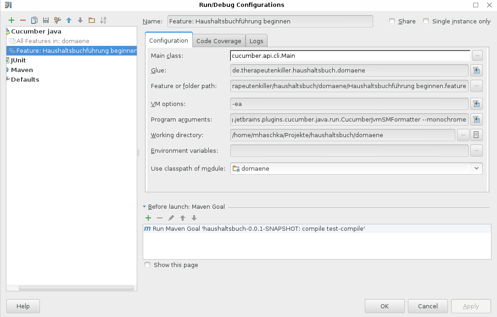

Anleitung für das Schreiben von Funktionalitäten und Szenarien
==============================================================

Die Funktionalitäten und deren Szenarien bilden einen wesentlichen Teil der
ubiquitären (allgegenwärtigen) Sprache (engl. ubiquitous language).

Für die sprachliche Abgrenzung zwischen Vorbedingungen, Anwendungsfällen und
Nachbedingungen in den Szenarien werden verschiedene Tempi benutzt, um eine
Überschneidung der Implementierungen im Glue Code zu vermeiden und präzise
die Intention auszudrücken.

Vorbedingung (Angenommen)
-------------------------

Die Vorbedingung wird im Perfekt formuliert, um eine bereits abgeschlossene
Handlung zu beschreiben, die Auswirkung auf die Gegenwart besitzt. Die
Vorbedingung besteht aus ein oder mehreren abgeschlossenen Anwendungsfällen.

Beispiel:
```gherkin
Angenommen ich habe mit der Haushaltsbuchführung begonnen
Und ich habe das Konto "Girokonto" angelegt
```


Anwendungsfall (Wenn)
---------------------

Ein Anwendungsfall beschreibt die Interaktionen zwischen Nutzer und System,
die notwendig sind, um ein fachliches Ziel des Nutzers zu verwirklichen.
Dabei dürfen die beschriebenen Abläufe nicht zu komplex werden.

Anwendungsfälle werden im Präsens Aktiv verfasst.

Beispiel:
```gherkin
Wenn ich das Konto "Geldbörse" anlege
```

Nachbedingung (Dann)
--------------------

Die Nachbedingung stellt das Ergebnis eines vorangegangenen Anwendungsfalls
dar. Im vorliegenden System kann das Ergebnis entweder durch eine Abfrage
oder ein Domänenereignis geprüft werden.

Wenn die Ergebnisprüfung durch eine Abfrage erfolgt, dann wird die
Nachbedingung im Futur I Passiv verfasst.

Beispiel für Nachbedingung mit Prüfung durch Abfrage:
```gherkin
Dann wird das Konto "Girokonto" angelegt
```

Wenn die Nachbedingung durch ein abgefangenes Domänenereignis geprüft wird,
dann wird Futur II Passiv verwendet. Domänenereignis werden in der UL
allgemein im Perfekt beschrieben. Z.B. *Konto wurde angelegt* oder *Buchung
wurde ausgeführt*. Da aus Sicht des Anwendungsfalls die Nachbedingung erst in
der Zukunft erfüllt sein wird, bietet sich für die Formulierung der
Nachbedingung die im Futur II an, um die abgeschlossene Handlung auszudrücken.

Beispiel für Nachbedingung mit Prüfung durch Domänenereignis:
```gherkin
Dann wird das Konto "Girokonto" angelegt worden sein
```

Wenn zur Prüfung der Nachbedingung eine Abfrage erfolgt und ein
Domänenereignis abgefangen wird, dann wird die Nachbedingung nur
einmal im Futur I formuliert und enthält beide Prüfungen, sofern
Abfrage und Domänenereignis die gleiche Intention ausdrücken.

Bei ungleicher Intention werden die Nachbedingungen getrennt in
Futur I für die Abfrage und Futur II für das behandelte Domänenereignis
formuliert.

Akteure und deren Personalpronomen
----------------------------------

Ausgehend von der Standardformulierung von Funktionalitäten in der Form,
in der ein Akteur mit dem Personalpronomen *ich* gleichgesetzt wird:

```
Als Akteur möchte ich etwas tun, um einen Mehrwert zu erhalten
```

folgt, dass in den Szenarien das Personalpronomen der ersten Person singular
*ich* weiter als der Hauptakteur verwendet wird, für den die Funktionalität
vorgesehen ist.

Beispiel:
```gherkin
  Szenario: Haushaltsbuchführung beginnen
    Wenn ich mit der Haushaltsbuchführung beginne
    Dann werde ich ein neues Haushaltsbuch angelegt haben
    Und ich werde ein Gesamtvermögen von 0,00 EUR besitzen
```

Zwar erscheint die häufige Verwendung des Personalpronomens eine egozentrische
Sicht einzunehmen, jedoch hebt es den Akteur als handelnde Person hervor und
versetzt den Autor in dessen Rolle. Insbesondere beim Verfassen der Aktion
sollte das Personalpronomen verwendet werden.

Vollständiges Beispiele
-----------------------

Das folgende Beispiel enthält ein vollständiges Szenario mit Abfrage und
behandeltem Domänenereignis und verwendet die vorgegebenen Tempi für die
einzelnen Schritte.

```gherkin
    Szenario: Pseudobeispiel für Tempusanwendung
        Angenommen ich habe einen Anwendungsfall ausgeführt
        Wenn ich einen anderen Anwendungsfall ausführe
        Dann werde ich das Ergebnis einer Abfrage prüfen
        Und ich werde ein Domänenereignis abgefangen haben
```

Wenn die Ergebnisprüfung mittels Abfrage und Domänenereignis in einem
Schritt erfolgen soll, dann sollte folgendes Muster verwendet werden:

```gherkin
    Szenario: Pseudobeispiel für zusammengefasste Nachbedingung
        Angenommen ich habe einen Anwendungsfall ausgeführt
        Wenn ich einen anderen Anwendungsfall ausführe
        Dann werde ich das Ergebnis prüfen
```


Konfiguration von IntelliJ
==========================

Working directory: Wurzelverzeichnis des Moduls.
VM Options: -ea



